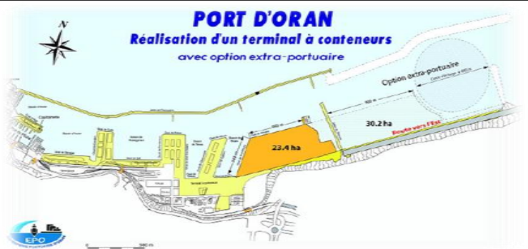
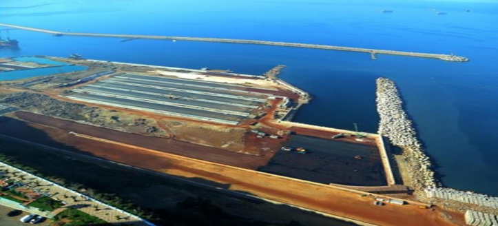
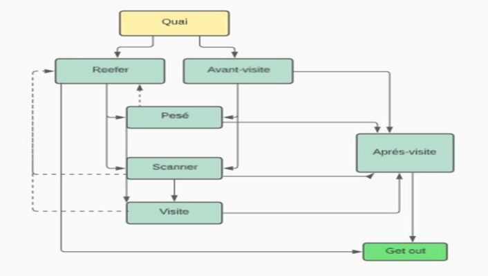
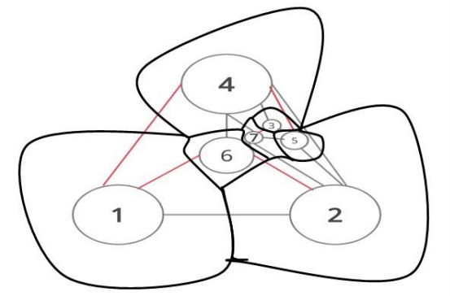
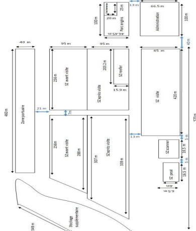
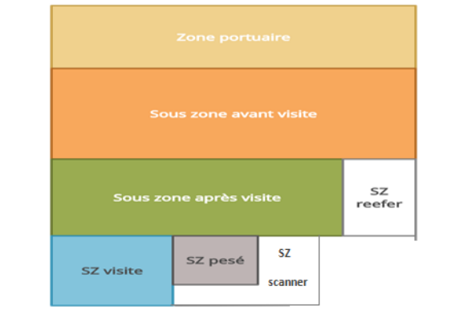
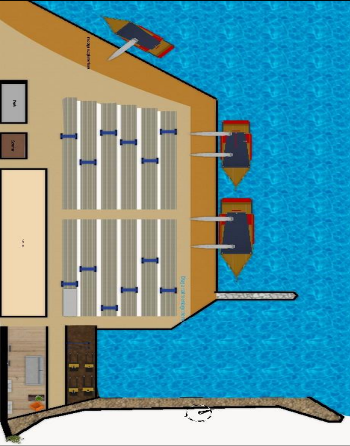
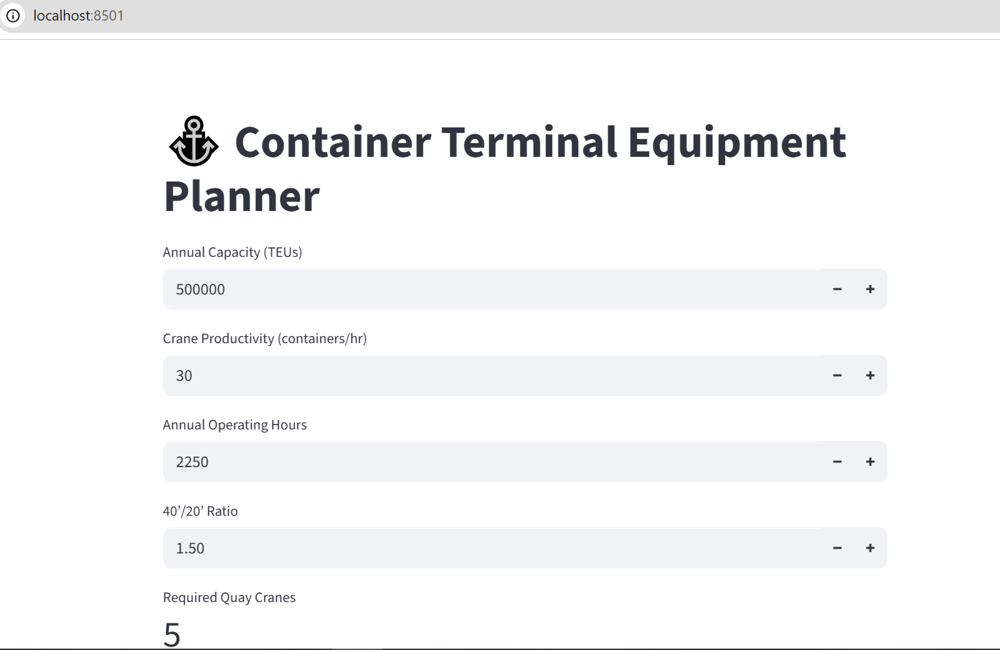

## Design of the new container terminal at Oran Port** 

---

## Abstract Summary

* The study focused on the **design of the new container terminal at Oran Port** and on solving the **allocation problem of containers in storage areas**.
* The goal was to minimize dwell time of containers in the terminal while respecting operational constraints.

---

## Research Questions / Objectives

* “**Find the optimal layout of the different sub-zones of the terminal**, based on static and dynamic capacity, using Facilities Design concepts.” (p. Introduction)
* “**Solve the container allocation problem**, determining adequate storage locations for arriving containers.” (p. Introduction)

---

## Motivation and Background

* Maritime transport is increasingly dominant in international trade due to cost efficiency and capacity.
* Containerization revolutionized logistics by standardizing cargo handling and accelerating intermodal transfers.
* Algerian ports face congestion and inefficiencies; modernization is needed to remain competitive.
* The new container terminal at Oran was selected as a case study to test methods of layout optimization and container allocation.

---

## Methods and Experimental Design

* **Study type**: Simulation + optimization modeling (mixed quantitative approach).
* **Datasets / Sources**:

  * Oran Port Company data, with baseline flows of **300,000 TEUs/year** and dynamic capacity projections.
* **Preprocessing & Instruments**:

  * Static and dynamic capacity calculations.
  * Activity Relationship Charts (ARC).
  * Flow matrices between terminal zones.
* **Algorithms / Procedures**:

  1. Systematic Layout Planning (SLP).
  2. Graph Theoretic Method.
  3. VIP-PLANOPT software (with and without constraints).
  4. Mathematical formulation of the Container Storage Problem (CSP).
  5. Optimization via **Lingo** and **CPLEX** solvers.
* **Evaluation Metrics**:

  * Number of non-productive moves (re-handlings).
  * Container dwell time.
  * Flow distances between zones.
  * Capacity utilization.

---

## Proposed Solution or Model

* **High-level description**:

  * Phase 1: Optimize the spatial layout of the terminal zones.
  * Phase 2: Model and solve the container allocation problem to minimize non-productive moves.
* **Algorithm Steps**:

  1. Collect and process flow/capacity data.
  2. Build flow matrices for baseline and projected demand.
  3. Apply SLP to propose a layout.
  4. Apply Graph Theoretic approach.
  5. Generate layouts with VIP-PLANOPT (constrained vs unconstrained).
  6. Formulate mathematical optimization model of storage allocation.
  7. Introduce two heuristics to reduce re-handlings.
  8. Solve the allocation model with Lingo/CPLEX and interpret results.
* **Hyperparameters / Configuration**:

  * Not explicitly reported; solver setup details not provided.

---

## Results and Findings

* **Layouts**: Four alternative zone arrangements generated (SLP, Graph Theoretic, VIP-PLANOPT without/with constraints).
* **Quantitative Results**:

  * Flow matrices developed for **300,000 TEU/year** baseline and dynamic capacity target.
  * Allocation model outputs in tables:

    * Table 13: Container-client assignments.
    * Table 14: Container cargo types.
    * Table 15: Container locations from Lingo solver.
* **Qualitative Findings**:

  * Proposed heuristics reduced the number of non-productive container moves.
  * Different methods provided alternative but feasible layouts for decision-makers.
* **Figures / Tables Referenced**:
# Container Terminal Optimization Project

This project focuses on the **optimization of container flows** at a new terminal within EPO, including terminal design, process flow, and storage allocation modeling.

# Container Terminal Optimization Project

This project focuses on the **optimization of container flows** at a new terminal within EPO, including terminal design, process flow, and storage allocation modeling.

---

##  Figures and Visuals

### 1. New Terminal Overview
- **new_terminal**  
    
  *General layout of the new container terminal at Oran Port.*

- **new_terminal_picture**  
    
  *Satellite/photographic view of the terminal infrastructure.*

---

### 2. Terminal Process
- **terminal_process**  
    
  *Process diagram showing container flow from ship arrival to yard storage and delivery.*

---

### 3. Zone Design & Graph Theory
- **graphes_theory_zones**  
    
  *Graph theoretic representation of inter-zone relationships and flow intensities.*

---

### 5. Modeling and Simulation Results
- **modelisation_results**  
    
  *Results of mathematical models and solver simulations (Lingo/CPLEX).*

---

### 6. Layout Methods and Alternatives
- **SLP_methode_resuls**  
    
  *Systematic Layout Planning (SLP) output for zone arrangement.*

---

### 7. Final Terminal Model
- **terminal_modelisation_final**  
    
  *2D/3D final model of the optimized container terminal layout.*

---

Perfect — for a **project portfolio**, you don’t just want raw equations, you want it presented in a **clean, professional, and visual style**.
Here’s how you can structure this section in your portfolio:

---

#  Container Terminal Equipment Dimensioning

This study estimates the **required number of quay cranes and trucks** to handle the expected throughput of the new container terminal at Oran Port.
Calculations are based on the **final terminal design (Design #4)** and on operational performance indicators.

---

##  Quay Cranes

### Method

[
N_{\text{cranes}} = \frac{Capacity}{Productivity \times Hours \times Ratio}
]

### Input Data

* Productivity: **30 containers/hour**
* Ratio 40’/20’: **1.5**
* Working time: **2250 hours/year**
* Target capacity: **500,000 containers/year**

### Result

[
N_{\text{cranes}} = \frac{500,000}{30 \times 2250 \times 1.5} \approx 5
]

 **5 quay cranes needed**

* Current: 2 cranes already available
* Additional: **3 cranes required**

**Allocation**

* Main quay: 4 cranes (2 per ship)
* Auxiliary quay: 1 crane

---

##  Internal Transport Trucks

### Method

* **Cycle Time**: loading + unloading + travel
* **Delivery Rate per Truck**:
  [
  R_{dv} = \frac{Available , Time}{Cycle , Time}
  ]
* **Number of Trucks**:
  [
  N_c = \frac{Daily , Demand}{Deliveries , per , Truck , per , Day}
  ]

### Input Data

* Loading/unloading: **45 s each**
* Speed: **25 km/h (6.9 m/s)**
* Avg distance: **73 m**
* Daily demand: **6000 containers**
* Availability: **85%**
* Operation: **3 shifts × 6 h = 18 h/day**

### Result

* Cycle time: **1.85 min**
* Deliveries per truck: **20/hour**
* Daily capacity per truck: **20 × 18 = 360 containers**
* Trucks required:
  [
  N_c = \frac{6000}{360} \approx 17
  ]

 **17 trucks needed**

* Current fleet: 10 trucks
* Additional: **7 trucks required**

---

##  Analysis & Strategic Value

* Investments should focus on **quay cranes** rather than yard cranes, as quay handling is the bottleneck.
* Increasing trucks from **10 → 17** will reduce waiting queues significantly.
* Equipment sizing aligned with **international port standards** ensures efficiency, safety, and competitive advantage.

---

# Container Terminal Optimization Project

This project focuses on the optimization of container flows at a new terminal within EPO, including
equipment calculation, yard allocation, and process modeling.

---

## 📊 Dashboard & Visualization

### Equipment Requirement Dashboard


*Interactive Streamlit dashboard showing required quay cranes and trucks vs current capacity.*

---

### Bar Chart Comparison


*Matplotlib chart comparing **current vs required** quay cranes and trucks.*

---

## 📝 Usage
- Run the calculation script:
  ```bash
  python src/main.py


## Discussion and Conclusions

* **Main interpretations**:

  * Optimized terminal layout increases operational efficiency.
  * Container allocation model reduces unproductive handling.
  * The approach can guide decision-making in Algerian port modernization.
* **Claimed Contributions**:

  * Practical application of Facilities Design to a container terminal.
  * Development of four layout alternatives.
  * Mathematical formulation and testing of the Container Storage Problem.
* **Limitations & Future Work**:

  * Tested only with a simplified dataset and small-scale case study.
  * Future studies should apply the model to full real datasets.
  * Exploration of advanced heuristics or metaheuristics is suggested.

---

## Replication Notes

* **Required for reproduction**:

  * EPO container flow data (baseline and projected).
  * Access to VIP-PLANOPT, Lingo, and CPLEX software.
  * Knowledge of ARC, SLP, and Graph Theoretic methods.


